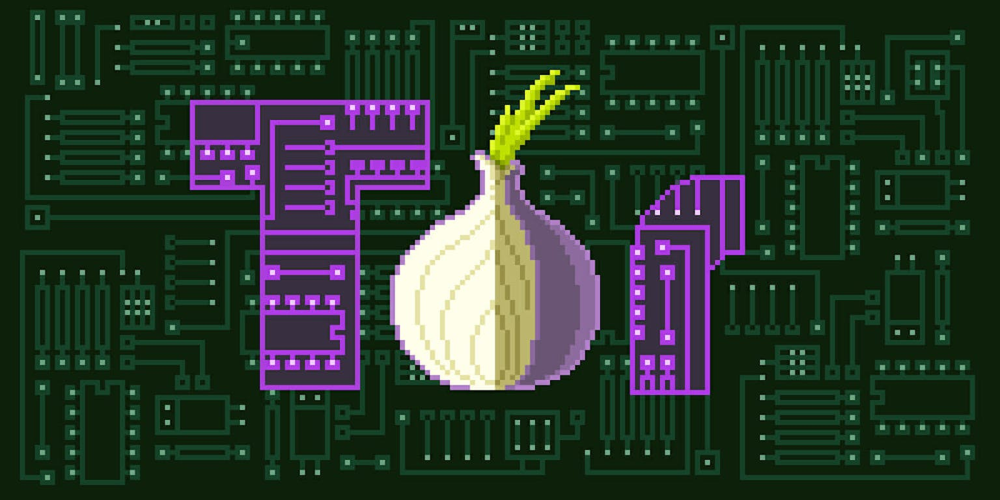

# Tor Gateway - Dockerized Tor Gateway

Welcome to the **Tor Gateway** project! This repository provides a Dockerized solution for setting up and managing a Tor gateway, allowing you to route your traffic through the Tor network for enhanced privacy and anonymity.

## Features

- **Dockerized Environment:** The gateway is fully containerized using Docker, making it easy to deploy and manage.
- **Automatic Configuration:** The Docker Compose setup automatically configures the Tor gateway, ensuring minimal setup time.
- **Security Focused:** The gateway is designed with security in mind, isolating your Tor traffic from the rest of your network.
- **Customizable:** Easily modify the Docker Compose file to suit your specific needs.

## Requirements

- **Docker**: Ensure that Docker is installed on your system. [Docker Installation Guide](https://docs.docker.com/get-docker/)
- **Docker Compose**: Make sure you have Docker Compose installed. [Docker Compose Installation Guide](https://docs.docker.com/compose/install/)

## Installation

1. **Clone the Repository:**

   ```bash
   git clone https://github.com/amrmarey/tor-gw-new.git
   cd tor-gw-new
   ```

2. **Build and Start the Tor Gateway:**

   ```bash
   docker-compose up -d
   ```

   This command will build the Docker image and start the Tor gateway in detached mode.

3. **Verify the Setup:**

   After the containers are up and running, you can verify that your traffic is being routed through the Tor network by checking your public IP address:

   ```bash
   curl --socks5 localhost:9050 https://check.torproject.org/
   ```

   The output should confirm that your IP address is recognized as a Tor exit node.

## Usage

- **Start the Gateway:**

  ```bash
  docker-compose start
  ```

- **Stop the Gateway:**

  ```bash
  docker-compose stop
  ```

- **View Logs:**

  To view the logs generated by the Tor gateway, use:

  ```bash
  docker-compose logs -f
  ```

## Configuration

You can modify the `docker-compose.yml` file to customize the behavior of the Tor gateway. Some configurable options include:

- **Ports:** Change the exposed ports to suit your network setup.
- **Volumes:** Mount custom configuration files if needed.
- **Environment Variables:** Pass environment variables to tweak Tor's behavior.

## Contributing

Contributions are welcome! Please fork the repository and create a pull request with your changes. Make sure to follow the existing code style and add tests for any new features.


## Acknowledgments

- [Tor Project](https://www.torproject.org/) - For providing the essential tools to enhance privacy online.
- The Docker community for providing an easy way to containerize and deploy applications.
